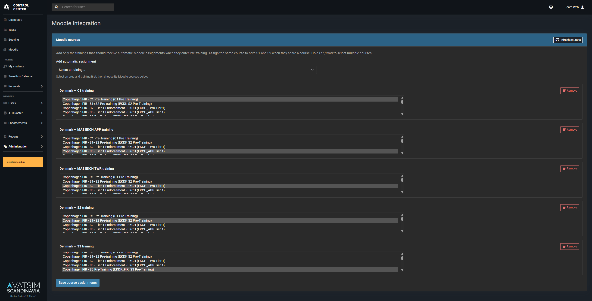
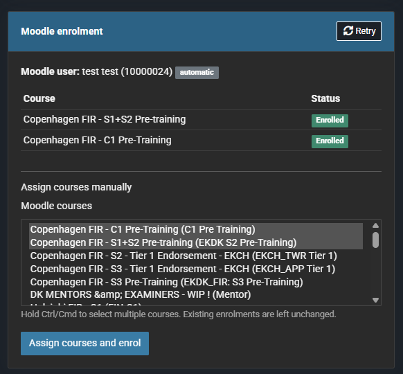

# Moodle

Control Center can automatically enrol students in Moodle courses when a training enters **Pre-training**. Course assignments are configured per area and training rating, so combined S1/S2 training, S3, C1, and local endorsements can use different courses.

Control Center first looks for a Moodle account whose username exactly matches the student's VATSIM CID. Training staff can search Moodle and link another account if the automatic match fails.

## Moodle service account

Use a dedicated Moodle account and role for Control Center. Do not use a site administrator token.

### Enable web services

1. In Moodle, open **Site administration > Advanced features** and enable web services.
2. Open **Site administration > Server > Web services > Manage protocols** and enable REST.
3. Create a dedicated user, for example `controlcenter-service`.
4. Create a custom role, for example **Control Center Service Account**, and allow it in the system context.
5. Assign the custom role to the service user at the system level. A category-level assignment can be used only when it covers every course and user operation required by the integration.

See Moodle's [external services documentation](https://moodledev.io/docs/5.0/apis/subsystems/external) for the web-service framework and site API documentation location.

### Required external service functions

Create an enabled custom external service under **Site administration > Server > Web services > External services** and add these functions:

| Function | Used for |
| --- | --- |
| `core_course_get_courses_by_field` | Refreshing the available course catalogue |
| `core_user_get_users_by_field` | Matching a Moodle username to a VATSIM CID and validating manually selected users |
| `core_user_search_identity` | Allowing training staff to search Moodle when automatic matching fails |
| `enrol_manual_enrol_users` | Enrolling the linked Moodle user in a selected course |

Moodle displays the required capabilities beside each function. The service role must have access to the course and user contexts used by the integration. At minimum, verify these capabilities:

- `moodle/course:view`
- `moodle/course:viewhiddencourses` when hidden courses should be available
- `moodle/user:viewdetails`
- `moodle/user:viewhiddendetails` when required by the site's privacy configuration
- `moodle/user:viewalldetails` for fallback identity search
- `moodle/course:useremail` when staff should be able to search by email
- `enrol/manual:enrol`
- `moodle/role:assign`

The manual enrolment method must also be enabled in every course Control Center manages.

!!! important "Allow assignment of the Student role"
    `moodle/role:assign` is not sufficient by itself. Open **Site administration > Users > Permissions > Define roles > Allow role assignments** and select the intersection of the **Control Center Service Account** row and the **Student** column. Moodle documents this additional relationship under [`moodle/role:assign`](https://docs.moodle.org/500/en/Capabilities/moodle/role%3Aassign).

    Without this matrix entry, Moodle rejects enrolment with an error such as `You don't have the permission to assign this role ...`.

### Create the token

1. Restrict the external service to authorised users and add the dedicated service user.
2. Open **Site administration > Server > Web services > Manage tokens**.
3. Create a token for the service user and the Control Center external service.
4. Copy the token into `MOODLE_TOKEN`. Treat it as a secret and do not commit it.

The configured student role ID is sent to `enrol_manual_enrol_users`. Confirm the Student role ID under **Site administration > Users > Permissions > Define roles** and set `MOODLE_STUDENT_ROLE_ID` accordingly. The standard Moodle Student role is commonly ID `5`, but installations can differ.

## Configure Control Center

Add the following environment variables:

```dotenv
MOODLE_ENABLED=true
MOODLE_URL="https://moodle.example.org"
MOODLE_TOKEN="your-web-service-token"
MOODLE_STUDENT_ROLE_ID=5
```

Apply the migrations and clear cached configuration with Sail:

```bash
./vendor/bin/sail artisan migrate
./vendor/bin/sail artisan optimize:clear
```

Control Center places enrolments on the database-backed `moodle` queue. Ensure the normal Laravel scheduler runs every minute in production. The scheduler starts a bounded worker for this queue when `MOODLE_ENABLED=true`.

For local development using the development compose file:

```bash
SAIL_FILES=docker-compose.dev.yaml ./vendor/bin/sail artisan migrate
SAIL_FILES=docker-compose.dev.yaml ./vendor/bin/sail artisan optimize:clear
SAIL_FILES=docker-compose.dev.yaml ./vendor/bin/sail artisan schedule:work
```

## Assign courses automatically

Users need the `training.moodle.manage` Control Center permission. Area-scoped training staff can configure only their accessible areas.

1. Open **Administration > Moodle integration**.
2. Select **Refresh courses**.
3. Under **Add automatic assignment**, select an area and training.
4. Select one or more Moodle courses and save the assignments.

The choices come from the training ratings configured for each area. When a training enters Pre-training, Control Center matches all rules for its area and attached ratings.



## Enrolment and fallback workflow

For every matching course, Control Center:

1. Looks for exactly one active Moodle account whose username equals the student's VATSIM CID.
2. Links that Moodle identity to the Control Center user.
3. Calls Moodle's manual enrolment API.
4. Records the result and retries transient failures up to three times.

The training page shows each course as pending, enrolled, or failed. Training staff can retry failed enrolments, add courses manually, or search Moodle by CID, username, name, or email and link the selected account. A Moodle identity cannot be linked to more than one Control Center user.



## Troubleshooting

### Course or activity not accessible

The service role cannot access one or more returned courses. Assign the service role at a context that covers the course, grant the required course-view capabilities, or exclude inaccessible courses from the service account's scope.

### Cannot assign the Student role

Confirm all of the following:

- `MOODLE_STUDENT_ROLE_ID` is the actual Student role ID.
- The service role has `enrol/manual:enrol` and `moodle/role:assign` in the course context.
- **Allow role assignments** permits the service role to assign the Student role.
- Manual enrolment is enabled for the course.

### No Moodle user found

The automatic match is deliberately exact: the Moodle username must equal the VATSIM CID. Use the training-page search to link a different Moodle account, then retry the enrolment.
