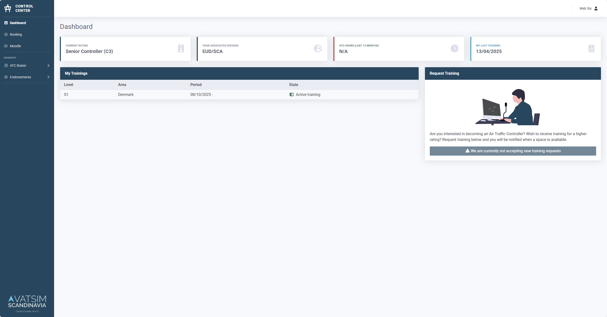
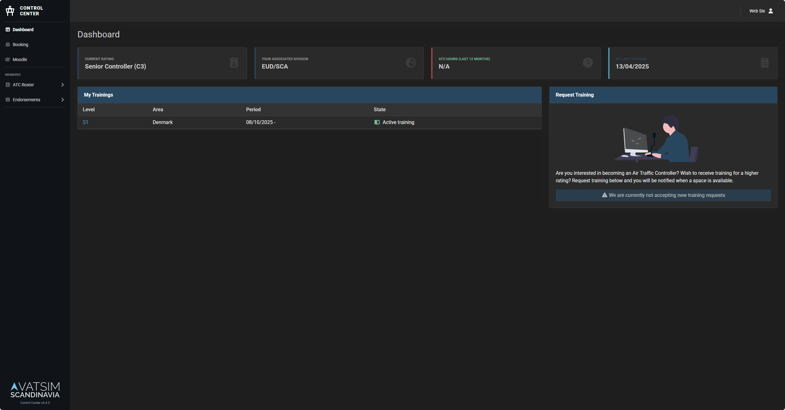

# Themes

Control Center ships a light and a dark theme. Each user selects one from `/settings`,
or leaves it on **System Default** to follow the operating system. The preference is
stored per user in the database and mirrored in browser storage, so the chosen theme is
painted on first load without flashing the wrong one.

Both themes are built from the same set of CSS custom properties, so anything you
override below applies in either mode.

=== "Light"

    

=== "Dark"

    

## Customizing Theme

To brand your instance, put your overrides in `resources/sass/themes/_custom.scss`.
That file is git-ignored, so your styles stay out of version control while still
compiling into the regular front-end build.

### 1. Create the override file

Copy the example to get started:

```sh
cp resources/sass/themes/_custom.scss.example resources/sass/themes/_custom.scss
```

### 2. Edit your colors

Edit `resources/sass/themes/_custom.scss`. Override only what you need.
Anything left out keeps its default.

Reference for the available values:

- `resources/sass/themes/_light.scss`: CSS custom properties for the light theme
- `resources/sass/themes/_dark.scss`: CSS custom properties for the dark theme
- `resources/sass/_variables.scss`: SCSS variables consumed by Bootstrap

### 3. Rebuild the assets

The CSS is compiled ahead of time, so the override only takes effect once the front-end
is rebuilt. How you do that depends on how you run Control Center.

=== "Without a container"

    ```sh
    npm run build
    ```

=== "With a container"

    Build your own image with the override baked in. See
    [Custom container image](./custom.md#custom-theme).

!!! warning "Don't build inside a running container"
    The published image contains no Node toolchain, and anything compiled into a running
    container is lost the moment it is recreated. Either bake the theme into an image you
    build yourself, or run Control Center without a container.

## Troubleshooting

### Theme not changing
- Clear browser cache (Ctrl+Shift+R / Cmd+Shift+R)
- Check JavaScript console for errors
- Verify assets are built: `npm run build`

### Colors look wrong
- Ensure you edited both the light and dark blocks in `_custom.scss` so the colors match in either mode
- Rebuild assets after changes
- Check CSS variables in browser DevTools

## Further Reading

- [Custom Container](./custom.md) - Persistent customizations
